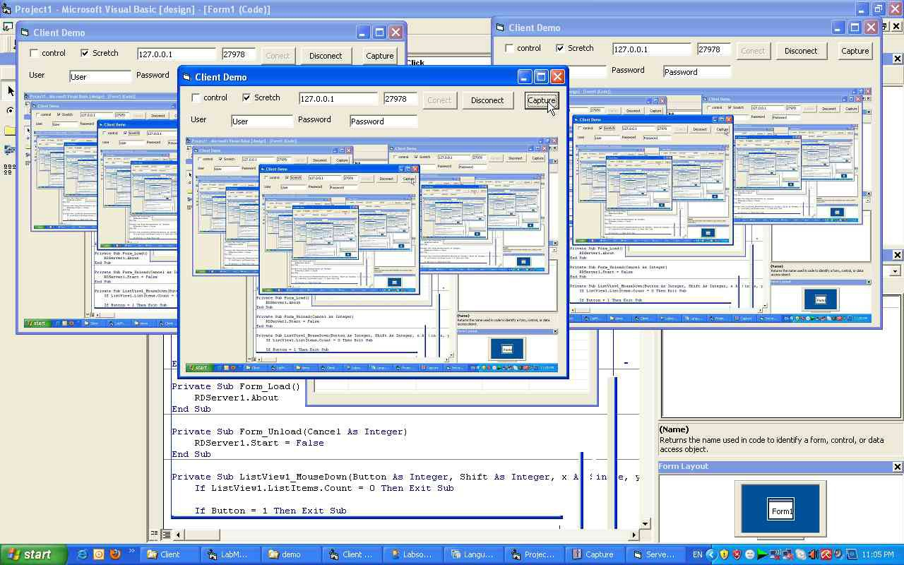



## Remote Desktop

### Description

Just Another Remote Desktop Like VNC with Winsock Control, No Other OCX Required.

Control Server Via Viewer

Control Mouse and Keyboard

Dual Monitor Support

Your Vote Will Be Great :D
 
### More Info
 

             |
---                |---
**Submitted On**   |2010-11-01 18:31:52
**By**             |[b2qid](https://github.com/Planet-Source-Code/PSCIndex/blob/master/ByAuthor/b2qid.md)
**Level**          |Advanced
**User Rating**    |4.0 (28 globes from 7 users)
**Compatibility**  |VB 6\.0
**Category**       |[OLE/ COM/ DCOM/ Active\-X](https://github.com/Planet-Source-Code/PSCIndex/blob/master/ByCategory/ole-com-dcom-active-x__1-29.md)
**World**          |[Visual Basic](https://github.com/Planet-Source-Code/PSCIndex/blob/master/ByWorld/visual-basic.md)
**Archive File**   |[Remote\_Des21926411122010\.zip](https://github.com/Planet-Source-Code/b2qid-remote-desktop__1-73583/archive/master.zip)

